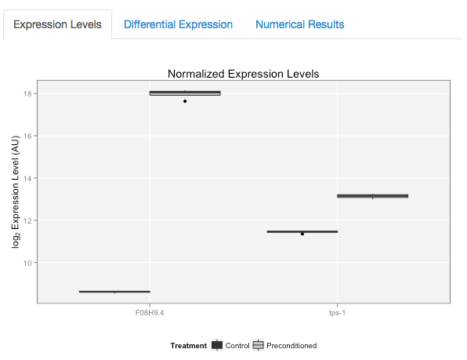

## User Guide

This document will help you find your way through the **Kurzchalia Microarray Database**. Please read the last section **Warning and Disclaimer** once, before you start.

### User interface

The user interface is designed by the [R][3] package [**shiny**][4], which is based on [bootstrap][5]. Therefore, it uses the standard shiny design. After a successful query, the website should look like this:

This design is very easy to navigate. All you have to do is:

1. Choose the experiment
2. Type in gene names
3. Choose the visualization

### 1. Choose the experiment

The results of two experiments are queried separately in this database. This is because the two experiments were done by using different chip designs and the data analyses were performed differently. Therefore, you should first choose the experiment that you want to query.

This can be done easily by using the menu at the very top of the page.

### 2. Type in gene names

Next, you need to enter valid gene names into the search box.

Gene names must be separated by comma (,). As you enter gene names, they will be looked up in the database and validated. Then, the plots and tables of the chosen experiment will refresh automatically.

Gene names in *C. elegans* are subject to change over time. There are *meaningful* gene names, such as *tps-1* as in "**t**rehalose-6-**p**hosphate **s**ynthase 1", but there are also sequence names, such as *F08H9.4*. Try first the short name, if you know it. If you see no update in the plot or table, it may be that the database uses the sequence name instead of the short name. Then you need to search for the gene in [WormBase][6] and find the sequence name.

In case neither the gene name nor the sequence name is accepted as a valid gene name, it means that the gene is not represented in the microarray design used for that experiment and unfortunately, there's nothing we can do about it. The desiccation experiment uses an older chip, which does not cover all *C. elegans* genes. The hypometabolism experiment should cover pretty much all genes.

### 3. Choose the visualization

For every experiment, there are 3 visualizations for selected genes. Once you enter gene names into the search box, you can navigate through these visualizations easily.

1. **Expression levels**: This plot shows the abundance of transcripts, as they were detected in the microarray experiment. Because we used single-color designs, probe intensity measured by the chip reader correlates with the abundance of the corresponding target mRNA molecule. Expression levels are normalized using various methods explained elsewhere, and presented in arbitrary units.

Sometimes expression levels are different from each other several orders of magnitude. In that case, visualization may not be informative. Then one can click the *Show y-axis in log2 scale* checkbox under the search box, and graph will be plotted again with the logarithms of expression values.

2. **Differential expression**: This plot shows the fold change of the transcript in the test group with respect to the control group. In the desiccation experiment, the control is the non-desiccated dauer. In the hypometabolism experiment, each control is the L3 larva of the corresponding strain, and each test group is the dauer(-like) larva.

This plot can also be redrawn with the y-axis in log scale. The error bars indicate 95% confidence intervals for each fold change.

3. **Numerical results**: This visualization shows the differential expression data in a tabular format. Each row is allocated for one gene. The gene names are linked to their corresponding WormBase entries for detailed information.

The first three columns correspond to the decimal fold change (FC) and its confidence limits (FC.L for the lower limit and FC.U for the upper limit). The next three column names are the same in logarithmic scale (logFC, logFC.L, logFC.U). The last column (adj.P.Val) shows the p-value after multiple hypothesis testing adjustment (Benjamini and Hochberg). This is basically the p-value, which determines if the fold change is significant or not. A p-value less than 0.05 is generally considered to be enough for statistical significance. P-values less than 0.001 are displayed as 0.000.

### Hypometabolism experiment

This experiment compares dauer larvae to L3 larvae in 4 genetic backgrounds. Therefore, normalized and differential expression levels are plotted separately for each strain. Also, the numerical results contain 4 tables instead of 1. Otherwise, querying the database for the results of this experiment can be done the same way as it is done for the desiccation experiment.

### Saving plots

Plots can be saved by right-clicking and choosing the download (or similar) command from the pop-up menu opened by the browser. At this stage, customization of plots is not possible, which means that you cannot change the design of the plot. However, you can adjust the size of your browser, and the plot will enlarge or shrink proportionally. The text sizes will stay the same, this resizing affects only the boxes, bars, whiskers and error bars.

In the upcoming versions, a more comprehensive plot exporting functionality will be implemented.

### Warning and Disclaimer

This database was built with the microarray data collected by the Kurzchalia Group at Max Planck Institute of Molecular Cell Biology and Genetics in Dresden. The datasets arise from two different experiments. The **desiccation** dataset is published and already accessible at [ArrayExpress][1]. The **hypometabolism** dataset has not been published yet. Therefore, please do not share the link to this website with third parties for the time being. When all data are published, the entire database will be made accessible to the public.

This is a beta version. All microarray analyses and underlying source code may or may not change in the future. The results are not guaranteed to agree with past or future studies conducted / will be conducted by other research groups. Because different chip designs were used in two experiments and their corresponding data were analyzed by slightly differing methods, these two datasets here cannot and should not be directly compared to each other.

Results from the **desiccation** dataset can be used in publications by citing the following article:

*Erkut C, Vasilj A, Boland S, Habermann B, Shevchenko A and Kurzchalia TV (2013) Molecular Strategies of the Caenorhabditis elegans Dauer Larva to Survive Extreme Desiccation. PLoS ONE 8(12): e82473. doi: [10.1371/journal.pone.0082473][2]*

[1]: https://www.ebi.ac.uk/arrayexpress/experiments/E-MEXP-3899/  "ArrayExpress"
[2]: http://doi.org/10.1371/journal.pone.0082473  "Article"
[3]: http://www.r-project.org "R-project"
[4]: http://shiny.rstudio.com "Shiny"
[5]: http://getbootstrap.com  "Bootstrap"
[6]: http://www.wormbase.org  "WormBase"

